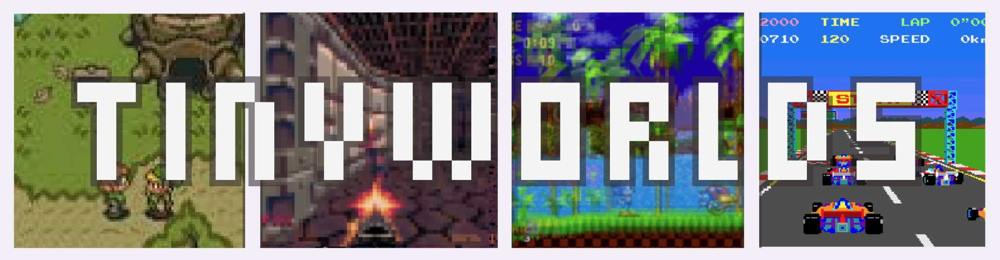
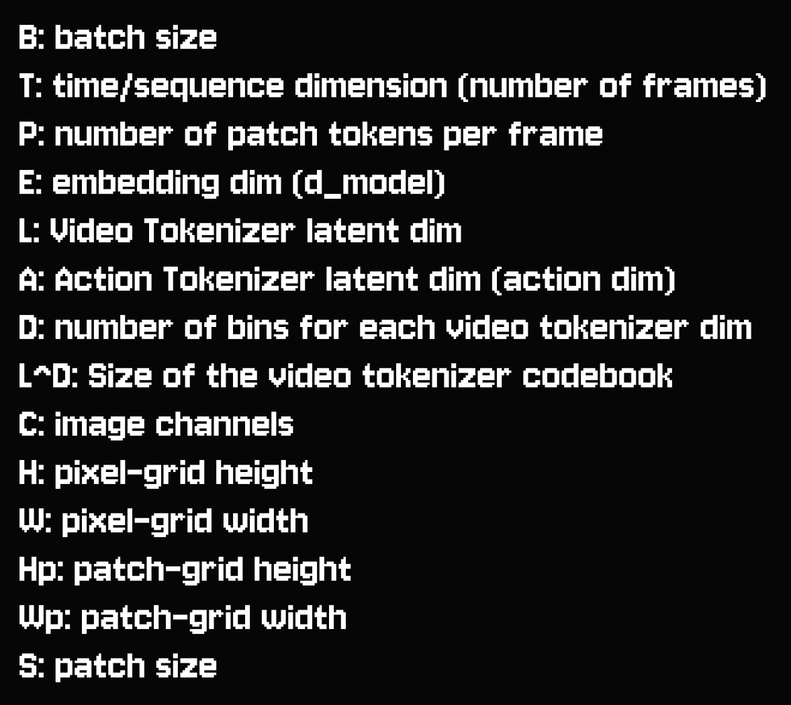

TinyWorlds is a minimal autoregressive world model built on Google Deepmind's [Genie Architecture](https://arxiv.org/pdf/2402.15391).

Because world models need video data **with action data**, we can't naively train on action-less internet video and scale like in Google's [VEO3](https://deepmind.google/models/veo/).

Google's [Genie 3](https://deepmind.google/discover/blog/genie-3-a-new-frontier-for-world-models/) solves this by inferring the actions between frames using **no action data**.

TinyWorlds is meant to help people understand world modeling and the clever autoregressive, unsupervised method Deepmind used to achieve **scalable world models**.

## Table of Contents

- [Installation](#installation)
- [Architecture Overview](#architecture-overview)
- [Priors](#priors)
   - [Space-Time Transformer (STT)](#space-time-transformer-stt)
   - [Variational Autoencoders (VAEs)](#vaes)
   - [Finite Scalar Quantization (FSQ)](#finite-scalar-quantization)
   - [Putting both Together: FSQVAE](#putting-both-together-fsq-vae)
- [Architecture](#architecture)
   - [Video Tokenizer](#video-tokenizer)
   - [Action Tokenizer](#action-tokenizer)
   - [Dynamics Model](#dynamics-model)
   - [Full TinyWorlds Inference](#full-tinyworlds-inference)
   - [Data](#data)
   - [Training and Inference Acceleration](#training-and-inference-acceleration-options)
   - [Shape Annotation Key](#shape-annotation-key)
- [Development Process and Decisions](#development-process-and-decisions)
- [An Appreciation of World Models](#an-appreciation-of-world-models)
- [Next Steps](#next-steps)


## Installation

```bash
git clone https://github.com/AlmondGod/nano-genie.git
cd nano-genie

# necessary installs
pip install -r requirements.txt
export WANDB_API_KEY=<YOUR_WANDB_API_KEY>
export PYTHONPATH="/workspace/nano-genie:$PYTHONPATH"

# download data (pong)
python scripts/download_assets.py datasets --pattern "pong_frames.h5"

# training
python scripts/full_train.py --config configs/training_config.yaml

# inference
python scripts/run_inference.py --config configs/inference.yaml
```

# Architecture Overview 


TinyWorlds uses an autoregressive world model over discrete tokens, so we can use SOTA LLM techniques to improve our world model. 

Why discrete tokens? Discretization makes our dynamics prediction problem much easier, because instead of predicting an image a near-infinite continuous space, it need only select one of the ~4096 tokens in our vocabulary.

Our world model consists of three modules:

**Video Tokenizer:** Continuous domains like audio and video require more clever tokenization than inherently discrete language. We tokenize using a VAE: we train a model to reconstruct a sequence of video, placing a small discrete bottleneck (our video tokens) in model's center which should capture the important information in the video.

**Action Tokenizer:** This infers the discrete action token between two frames. We again use a VAE to reconstruct the next frame conditioned on the previous frame and a discrete bottleneck (our action token) that encodes information of the transition between previous and next frame.

**Dynamics Model:** Given action and past frame tokens, this predicts our next frame tokens. This is the core of our world model that captures the structure and emergent phenomena of our tiny video game worlds.

# Architecture Priors

STTransformer is used in all 3 models, and FSQVAE is used in both tokenizers. Thus, we'll go over STT and FSQVAE before examining the structure each of the 3 models in-depth.

## Space-Time Transformer (STT)
papers: [STTransformer](https://arxiv.org/pdf/2001.02908), [FiLM](https://arxiv.org/pdf/1709.07871), [RMSNorm](https://arxiv.org/pdf/1910.07467), [SwiGLU](https://arxiv.org/pdf/2002.05202)


The Space-Time Transformer consists of B spatial/temporal blocks, where each block contains a spatial attention layer, a temporal attention layer, and a feedforward layer. For a brush up on regular self-attention, see Karpathy's [GPT From Scratch Video](https://youtu.be/kCc8FmEb1nY?si=tvfcBnGHBbEiS70v&t=3748).

In the spatial layer, each token attends to all other tokens in the same frame (within its timestep). Attention operates over a given timestep with P tokens, where P = Hp x Wp, Hp = Pixel height / patch size (# patches along the H dimension), and Wp = Pixel width / patch size (# patches along the width dimension). 

In the temporal layer, each token in a given position attends causally to other previous tokens in the exact same position but previous timesteps. Attention operates causally over slices of T x 1 across T timesteps for the same token.

In the Feedforward Layer, we could use a basic FFL: Wx + b -> ReLU -> Wx + b -> LayerNorm. However, it turns out that SwiGLU allows for greater model capacity and faster learning for the same number of parameters.
SwiGLU comes from Swish, which is x * sigmoid(x). SwiGLU adds a Gated Linear Unit (GLU), so we first compute x_t = Swish(W_1x + b) to W_2x + b, and then we have a final wx_t + b.

Both attentions and the feedforward have norms afterward (postnorm), either unconditioned (for Video Tokenizer and LAM Encoder) or conditioned on actions (for LAM decoder and the dynamics model). 

For unconditioned STTransformer, we use RMSNorm, which computes norm as sqrt(eps + x / sum of x^2)

For conditioned STTransformer, we use Feature-wise Linear Modulation (FiLM). FiLM takes in the conditioning, in this case, actions for each timestep. It then uses a FeedForward Layer to transform each action latent into one beta vector and one gamma vector, both of embedding dim length. we then compute the norm as layernorm(x) * gamma + (1 + beta)


### VAEs
Paper: [Overview of VAEs](https://arxiv.org/pdf/1906.02691), Eric Jang's [Variational Methods](https://blog.evjang.com/2016/08/variational-bayes.html)

VAEs consist of:
1. Encoder network to parameterize posterior distribution $q(z | x)$ of latent random variables z given input data x (probability image is a cat given a frame of a cat)
2. Unknown prior distribution $p(z)$ (probability any random thing is a cat)
3. Decoder network to parameterize likelihood $p(x | z)$ over input data x given latent z (frame of cat given idea of cat)

We cannot learn these quantities directly, but we can instead learn to maximize the likelihoods of z | x and x | z by ascending the reconstruction objective p(x | z | x), where z will learn semantically meaningful information because we constrain its dimensionality be low (it is forced to choose only the most important information from an image).

### Finite Scalar Quantization

Posterior and prior distributions are categorical, and samples drawn from these fall into a specific region of a hypercube, which are used as discrete inputs to decoder network.

Latent Embedding Space $|e| = {L^{D}}$ where $L$ is the number of levels/bins per dimension and $D$ is the dimensionality of the hypercube (number of dimensions in the latent embeddings). Essentially, for each dimension, we can fall into one of L buckets, and we have D dimensions. if we had 3 dimensions and 2 levels per dimension, we'd have 2^8 possible regions in the cube.

Input $x$ passed through encoder to produce $z_e(x)$, and discrete latent $z$ is calculated by:

1. tanhing to [-1,1]
2. transforming to [0, L]
3. rounding to the nearest integer
4. transforming back to [-1,1]

the resulting discrete latent vector $e_k$ is used as input to decoder network.

## Putting both Together: FSQ-VAE

In FSQVAEs, the discretization process has a straight-through gradient, where the input to the decoder is equal to z + stopgrad(z_q - z). So the quantity is z_q, but the gradient is on z.

We thus need no extra loss terms unlike in VQVAE, which makes this method siginificantly more wieldy.

stopgrad is the stopgradient operator (in pytorch, .detach()) that is identity at forward computation time and has zero partial derivatives, and thus constrains the operand to be non-updated constant.

# Architecture

## Video Tokenizer

The video tokenizer compresses videos into discrete tokens to reduce dimensionality and have higher quality video generation.
It does so as an FSQVAE implemented with an STTransformer that attends to tokens full-spatially and temporal-causally. 
Thus, each token contains information about its frame in relation to itself and to previous frames. 

## Action Tokenizer

The Action Tokenizer allows us to train without labels by learning unsupervised actions between to frames. We can then condition the dynamics on action without needing action labels for data

The LAM Encoder takes in a sequence of frames $(x_1...x_t+1)$, and outputs a corresponding set of continuous action latent vectors between the frames $(a_1...a_t)$, where a_1 is the action taken between x_1 and x_2.

To create the discrete action codebook, we again use an FSQ objective to bound and bin the continuous action latent vectors outtputed by the encoder into one of |codebook size| cubes which represent our codebook.

The LAM Decoder takes in all previous frames $(x_1...x_t)$ and quantized action latent vectors $(x_1...x_t)$ as input and predicts the next frame $x_{t + 1}$.

Since the decoder only has access to frame history and the action token, $a_t$ should encode most meaningful change between the past frame and the future frame for decoder to successfully reconstruct future frame. 

In practice, the decoder tends to try to ignore actions as much as possible. To counteract this, we mask most frames except the first, so the decoder must learn to use the string of actions as signal. We also add auxiliary variance regularization batch-wise to the encoder.

At inference time, we only use the learned cubes (latents) which correspond to action indices that the user can output. These actions should each end up corresponding to a semantically meaningful condition for next frame prediction.

## Dynamics Model
Additional paper: MaskGIT (https://arxiv.org/pdf/2202.04200)

At a high level, we want that at timestep $t \in [1, T]$, the dynamics model takes in tokenized video and action sequences from t=0 (defined as context-length frames old) up to $t - 1$ and predict next frame tokens $z_t$.

In practice, we use a method similar to MaskGIT and BERT: we mask a subset of tokens, and train our model to predict the masked tokens conditioned on all current and previous frame tokens. The prediction is conditioned on action tokens inferred at train time by the action tokenizer.

For inference, at each step, we append a fully masked frame to our context sequence, then our model iteratively predicts next frame tokens using MaskGIT Inference as follows:
For T steps:
1. Predict logits at each masked position and compute token probabilities
2. Take the k most likely tokens out of the still unmasked positions and sample them, unmasking their positions
We choose k using the exponential schedule (first step would sample ~1 token, then ~2, then ~5, then ~20, then ~50, etc)


## Full TinyWorlds Inference

We first give the model an initial frame from the training distribution and tokenize the image with our video tokenizer
We then run the following loop:
3. The player specifies one of the n_actions action tokens to use by choosing integer value in $[0, |A|]$
4. Condition the dynamics model with context window c on the video tokens t-c...t and action tokens t-c..t and run dynamics inference 
5. Detokenize the predicted video tokens into a new video frame for the user

We repeat process autoregressively over the time dimension as actions are passed to model and tokens are predicted by the dynamics model and detokenized into frames to display to the user.

## Data

The data is processed and downsampled from mp4s into hdf5 files. You can download the following datasets I uploaded to huggingface ([Datasets](https://huggingface.co/datasets/AlmondGod/tinyworlds), [Pretrained models](https://huggingface.co/AlmondGod/tineyworlds-models))


1. PicoDoom (`picodoom_frames.h5`)
2. Pong (`pong_frames.h5`)
3. Zelda Ocarina of Tima (`zelda_frames.h5`)
4. Pole Position (`pole_position_frames.h5`)
5. Sonic (`sonic_frames.h5`)

Any data can be added by creating a new dataclass and specifying the mp4 path in [datasets.py](datasets/datasets.py)

```bash
# retrieve data and downlaod into data/
python scripts/download_assets.py datasets --pattern "sonic_frames.h5"

# puls sonic dynamics checkpoint into results/<TIMESTAMP>_sonic_models/dynamics/checkpoints
python scripts/download_assets.py models --type dynamics --suite-name sonic_models
```

## Training and Inference Acceleration

TinyWorlds uses the following:
1. torch compile which allows us to use faster kernels for certain pre-optimized operations
2. distributed data parallel (DDP) which allows us to train using multiple gpus by using different data per-gpu
3. automatic mixed precision (AMP) which dynamically switches between FP32 and BF16 based on the current nodes used floating point range
4. FP32 training which lets us use nvidia floating point 32 for extremely precise floating point operations 
(all of the above were made much easier by torch, thank you torch team)


## Shape Annotation Key

When looking through the codebase, I shape-annotate all tensors and use einops tensor manipulation operations with the following abbreviations:




## Filling in the Gaps (and Differing) from Genie

### FSQ vs VQVAE
In Genie 1, VQVAE is used for both the video tokenizer and the action tokenizer. 

VQVAE is notoriously difficult to train: it has 2 auxiliary losses that demand careful tuning, and often ends in codebook usage lower than 10%.

I searched for alternatives and settled on the most recommended, FSQ, which worked as a drop-in fix and led to 100% codebook usage out of the box. FSQ is a genius algorithm.

### Additive Action Embeddings vs FiLM
Genie 1 conditions frame genration on actions by adding the action embeddings to the video embeddings. 

I tried additive and then FiLM, and found FiLM led the action tokenizer decoder to pay more attention to action tokens.

### Countering action tokenizer collapse
By far the greatest challenge was avoiding action tokenizer collapse, which I solved by:
1. Switching VQVAE to FSQVAE
2. Using only the first frame and masking all others
3. Adding low-weight variance loss to the pre-quantization encoder outputs across the batch dimension

### Low-level architecture decisions
I found RMSNorm better than layernorm, and found SwiGLU better than ReLU. L1 loss led to sharper reconstructions than L2, which encouraged muted tones.

The default model uses 4 transformer blocks, with d_model 128, 8 heads, 512 FFN hidden dim (SwiGLU takes 2/3 of this for each W matrix), and 4-frame sequences which make for around ~2M parameter tokenizers and dynamics model.

## An Appreciation of World Models
A world model predicts the next state of an environment given current state and some conditioning. 

To predict the next world state, we encode the structure and emergent phenomena of the universe itself.

We train a deep network which, given an image and action, predicts the most likely next image.

World models can both act as cortexes to give physical world understanding to models and as simulators for models and humans to experience new structures of reality.


## Next Steps

- [ ] Implement MoE in the Feedforward layer
- [ ] Try RoPE/AliBi Spatial/Temporal Position Embeddings
- [ ] Scale! Train on more GPUs and scale to multibillions of params by adding FSDP Support
- [ ] Add more datasets (Terraria, Street Fighter, your favorite retro videogame!) 
- [ ] Replace the mean pool + concat in the action tokenizer with attention pooling (t to t + 1 then mean pool)
- [ ] Accelerate dynamics training by producing, saving, and loading pre-processed tokens instead of full frames 
- [ ] Try different optimizers (Muon, SOAP)

**Please make a PR! I've added TODOs throughout and there are many small things to try which could offer massive performance gains. The codebase is meant to be built upon.**

*aesthetic inspired by [Tinygrad](https://tinygrad.org/) and [Tinygpu](https://github.com/adam-maj/tiny-gpu)*